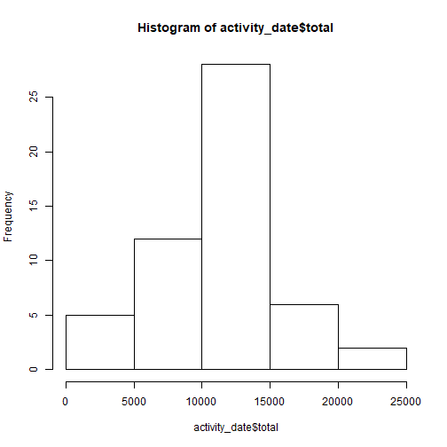
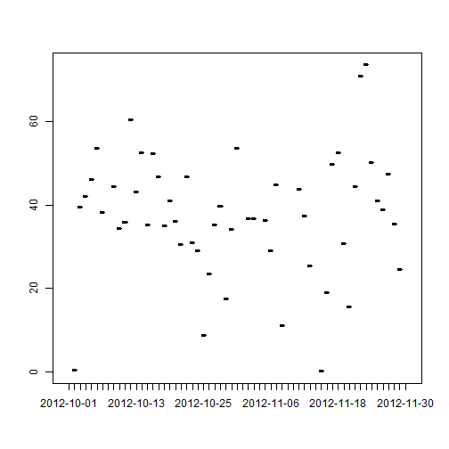
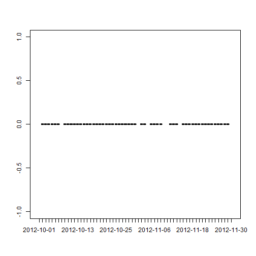
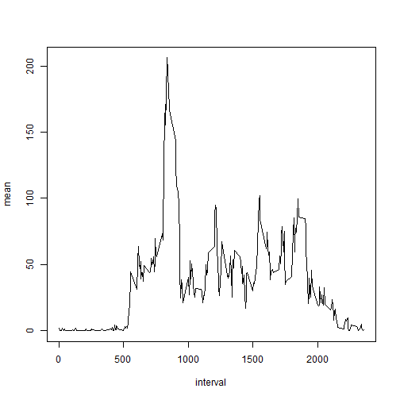
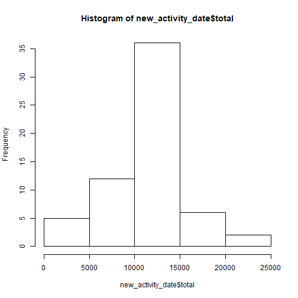
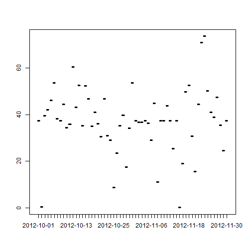
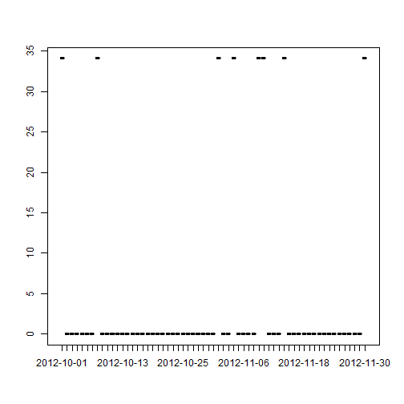
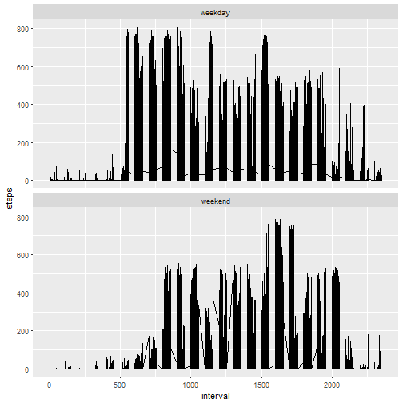

## Reading and Processing data

```r
library(dplyr)
activity <- read.csv(file = "activity.csv")
```

## Mean total number of steps taken per day

```r
activity_date <- group_by(activity, date)
activity_date <- summarise(activity_date, mean = mean(steps, na.rm = TRUE), 
                           count = n(), total = mean*count,
                           median = median(steps))
hist(activity_date$total)
```



```r
with(activity_date, plot(date, mean))
```



```r
with(activity_date, plot(date, median))
```



##  average daily activity pattern

```r
activity_time <- group_by(activity, interval)
activity_time <- summarize(activity_time, mean = mean(steps,na.rm = TRUE))
with(activity_time, plot(interval, mean, type = "l"))
```



```r
maxinterval <- activity_time$interval[which.max(activity_time$mean)]
```
The interval with max mean steps is 835

## Imputing missing values

```r
numNA <- sum(is.na(activity$steps))
new_activity <- activity
new_activity$steps[is.na(activity$steps)] <- 
    activity_time$mean[match(activity$interval[which(is.na(activity$steps))],
                             activity_time$interval)]

new_activity_date <- group_by(new_activity, date)
new_activity_date <- summarise(new_activity_date,
                               mean = mean(steps, na.rm = TRUE), 
                               count = n(), total = mean*count,
                               median = median(steps))

hist(new_activity_date$total)
```



```r
with(new_activity_date, plot(date, mean, type = "l"))
```



```r
with(new_activity_date, plot(date, median, type = "l"))
```


The number of na is 2304
The difference can be observed in the plots above

## Differences in activity patterns between weekdays and weekends

```r
new_activity <- mutate(new_activity,
                       weekday = weekdays(as.Date(new_activity$date)))
new_activity$weekday <- sub("星期一|星期二|星期三|星期四|星期五", "weekday",
                            new_activity$weekday)
new_activity$weekday <- sub("星期六|星期日", "weekend",
                            new_activity$weekday)

library(ggplot2)
g <- ggplot(new_activity, aes(interval, steps))
g + geom_line() + facet_wrap(~weekday , nrow = 2)
```




